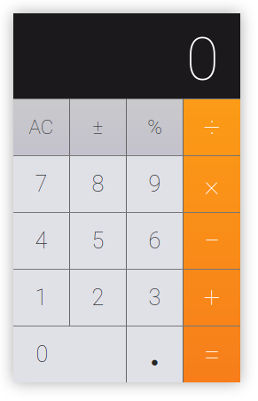
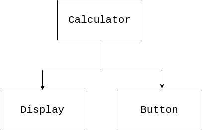

# React Calculator

In this project you will be building a virtual calculator device in React.

The purpose of this assignment is to practise building a React application.

## What you will be doing

This project assumes you've already had experience with:

- React Basics
- create-react-app
- React Components
- Handling state in React
- Handling styles in React

## Expectations

✔ Change the design if you like (for example, colours, dimensions or layout). You **do not** have to match the design 100%.

✔ Separate your code into components

✔ You can use functional or class based components, or both

❌ You do not have to implement all of the functionality of the calculator. That is not the goal of this assignment.

## Assignments

Create a new project folder, using `create-react-app`

Use a folder name of your choice

[How to use create-react-app](https://reactjs.org/docs/create-a-new-react-app.html#create-react-app)

## Assignment 1 - Think before you write

We all want to start write code straight away. Take some time to think about the code you will write, before you write it.

Take a look at the following image.

1. How would you break this design into smaller parts?

2. What React components could you create?

3. Can any of those components be re-used?

4. How many components will you need?

## Assignment 2 - Our top level component

Begin by creating a top level component. This will be the calculator component.

- Since it will be the parent of all the other components, it can be in the root of your project

- For now, this calculator component will be empty

## Assignment 3 - Our next component

Create a folder called 'components'.

- Create a display component inside this folder. This will be the screen of the calculator

- Import and use the display component into the top level calculator component

## Assignment 4 - State

We will need to keep track of the state of the display (the number on the screen of the calculator).

> We will not keep the state in the display component. Why? This is a presentational component. It is a low-level component, and should be as simple as possible.

We will keep the state in the top level component (the calculator component).

- Add state into your calculator component

- Add a key in the state which will hold the contents of the display

- Set the default value for this key to the string `"0"`

> Note: We will use a string because it will make it easier to perform string operations later

> Hint: If you used a functional component for the calculator component and do not yet know how to add state using React Hooks, you will need to convert your component to a class based component

Research: [State and Lifecycle](https://reactjs.org/docs/state-and-lifecycle.html)

## Assignment 5 - Passing state to a child

Now your top level component is keeping track of the contents of the display, you will want to pass this state value into the display component

- Pass the value for the key you just created in the state, as a prop to the display component

- Inside the display component, use `props` to receive and show the prop you passed in from the parent component

Research: [Components and Props](https://reactjs.org/docs/components-and-props.html)

> Try: If you change the state from your top level component, it should reflect automatically in the child (display) component

## Assignment 6 - More components

Let's create our next component. The button component.

- Create a button component

- Import and use this button in the top level component

- How can you re-use this component?

## Assignment 7 - Re-usability

You might be thinking of creating a button component for each button on the calculator - but this is too much work.

In fact, there is no need to create a new component for each button on the calculator. We only need one button component, and we can customise it for each key.

We will stick with one button component, and pass in the values we need to customise it from its parent (the top level component)

- Modify your code so that you can send the "key" which appears on the button from its parent

For example, if the "key" should be `5`, then you need to pass the value `5` from the parent to the child (send it as a prop)

**This is how your application should be structured:** 

## Assignment 8 - More and more keys

Using the solution for assignment 7:

- Create all the keys for the calculator

## Assignment 9 - Add some styles

- Add some styles to your buttons

- Add some styles to your display

> Hint: There are many ways to go about this, you can use css modules, or you can simply use a static css file and refer directly to the classes

## Assignment 10 - Customising the keys

Not all keys on the calculator are the same. Some are larger than others, and some have a different colour. How can we customise the keys if we are using the same React component for all of them?

The answer is simple. We pass in these configuration settings as props. For example, if we want to pass in a different background colour, we might pass in a prop called "colour", etc.

- Pass into the button component props for the size of key and for the colour of the key.

> Hint: These can be strings. You can match for them in the component itself and choose a css classname based on the result

## Assignment 11 - Adding logic 

By now your calculator should look like a calculator, but it probably does not work like a calculator. We need to add the logic to make the calculator work.

How does a calculator work?

Take a moment to think about how the calculator should work and what should happen when you click on the keys.

- Create a method in your top-level component which will be called when you press the key `5`. Give it a good name.

- This method should modify the state. If the existing number is `"0"` it should replace that number. If the existing number is greater than`"0"` it should add it to the end of the string.

> Hint: Before you can do a mathematical comparison, you will need to convert the string to a number.

> Hint: The state should always remain as a string

## Assignment 12 - Passing the method as a prop

Your button component itself does not have any methods or responsibilities. However, we can tell it what to do if we pass in the 

- Pass in the method you created in Assignment 11 as prop into the instance for button number "5". This will be the callback.

- Use the `onClick` attribute inside the button component to call the prop which contains the callback. This should work when the user clicks the button.

## Assignment 13 - Now the rest

Do the same for the rest of the buttons